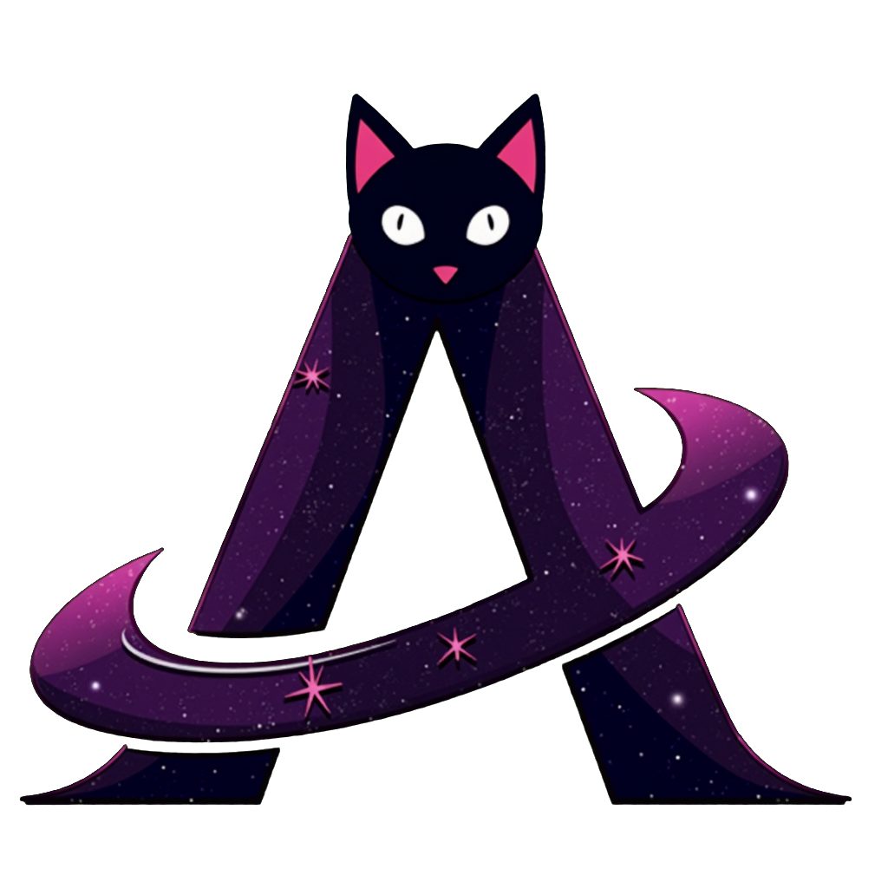

<a name="readme-top"></a>

<!-- PROJECT LOGO -->
<br />
<div align="center">
  <a href="https://github.com/kaylaa0/landing-page">
	
  </a>
  <p align="center">
	<h3 align="center">Landing Page 2022</h3>
	<a href="https://v1.kayla.works"><strong>View Live »</strong></a>
  </p>
</div>

<!-- TABLE OF CONTENTS -->
<details>
  <summary>Table of Contents</summary>
  <ol>
	<li>
	  <a href="#about">About</a>
	  <ul>
		<li><a href="#built-with">Built With</a></li>
	  </ul>
	</li>
	<li>
	  <a href="#getting-started">Getting Started</a>
	  <ul>
		<li><a href="#installation">Installation</a></li>
	  </ul>
	</li>
	<li><a href="#usage">Usage</a></li>
	<li><a href="#roadmap">Roadmap</a></li>
  <li><a href="#license">License</a></li>
	<li><a href="#contact">Contact</a></li>
	<!--<li><a href="#acknowledgments">Acknowledgments</a></li>-->
  </ol>
</details>

<!-- ABOUT THE PROJECT -->

## About The Project

An astro landing page created by referancing various templates. It has a custom build scrolling mechanism that acts as a slide show.

Bundled with brief information about me, my projects and links to my social media profiles.

<!-- BUILT WITH -->

### Built With

-   [![Astro][Astro]][Astro-url]
-   [![Vite][Vite]][Vite-url]
-   [![TypeScript][TypeScript]][TypeScript-url]
-   [![Preact][Preact]][Preact-url]
-   [![Sass][Sass]][Sass-url]
-   [![Tailwind CSS][Tailwind CSS]][Tailwind CSS-url]
-   [![Partytown][Partytown]][Partytown-url]
-   [![Node.js][Node.js]][Node.js-url]
-   [![Yarn][Yarn]][Yarn-url]

<!-- GETTING STARTED -->

## Getting Started

### Installation

1. Install Node.js
    ```sh
    https://nodejs.org/
    ```
2. Install Yarn
    ```sh
    npm install --global yarn
    ```
3. Install Dependencies
    ```sh
    yarn install
    ```
4. Run the project
    ```sh
    yarn dev
    ```

<!-- USAGE GUIDE -->

## Usage

Scroll down to see the content. Click on the social media icons to visit my profiles.

<!-- ROADMAP -->

## Roadmap

-   [x] Create README.md
-   [x] Make the source public

<!-- LICENSE -->

## License

<br />
<div style="display: flex; align-items: center;">
  
  <span style="margin-left: 10px;">This work is licensed under a <a rel="license" href="http://creativecommons.org/licenses/by-nc-nd/4.0/">Creative Commons Attribution-NonCommercial-NoDerivatives 4.0 International License</a>.</span>
</div>
<br />

See `LICENSE.md` for more information.

<!-- CONTACT -->

## Contact

Kayla Akyüz - kaylakyuz@gmail.com

Project Link: [GitHub](https://github.com/kaylaa0/landing-page)

[![LinkedIn][linkedin-shield]][linkedin-url]

<!-- ACKNOWLEDGMENTS
## Acknowledgments


* Thanks to for the amazing 2D assets.
-->

<p align="right">(<a href="#readme-top">back to top</a>)</p>

<!-- MARKDOWN LINKS & IMAGES -->

[linkedin-shield]: https://img.shields.io/badge/-LinkedIn-black.svg?style=for-the-badge&logo=linkedin&colorB=0077B5&colorA=0077B5
[linkedin-url]: https://www.linkedin.com/in/-kayla-/
[Astro]: https://img.shields.io/badge/Astro-BC52EE?logo=astro&logoColor=fff&style=for-the-badge
[Astro-url]: https://astro.build/
[Vite]: https://img.shields.io/badge/Vite-646CFF?logo=vite&logoColor=fff&style=for-the-badge
[Vite-url]: https://vitejs.dev/
[TypeScript]: https://img.shields.io/badge/TypeScript-3178C6?logo=typescript&logoColor=fff&style=for-the-badge
[TypeScript-url]: https://www.typescriptlang.org/
[Preact]: https://img.shields.io/badge/Preact-673AB8?logo=preact&logoColor=fff&style=for-the-badge
[Preact-url]: https://preactjs.com/
[Sass]: https://img.shields.io/badge/Sass-CC6699?logo=sass&logoColor=fff&style=for-the-badge
[Sass-url]: https://sass-lang.com/
[Tailwind CSS]: https://img.shields.io/badge/Tailwind_CSS-38B2AC?logo=tailwind-css&logoColor=fff&style=for-the-badge
[Tailwind CSS-url]: https://tailwindcss.com/
[Partytown]: https://img.shields.io/badge/Partytown-2E6AC9?logo=data:image/svg+xml;base64,PHN2ZyB4bWxucz0iaHR0cDovL3d3dy53My5vcmcvMjAwMC9zdmciIHZpZXdCb3g9IjAgMCAxNTE3LjQ1IDE1ODkuNzYiPjxnPjxjaXJjbGUgY3g9IjEzMy44OCIgY3k9IjMzOS44OSIgcj0iNzAuNDciIGZpbGw9IiNmZmYiLz48Y2lyY2xlIGN4PSIxMjEzLjExIiBjeT0iMjgwLjE1IiByPSI3MC40NyIgZmlsbD0iI2ZmZiIvPjxjaXJjbGUgY3g9IjEyNzAuMyIgY3k9IjExODUuNTEiIHI9IjcwLjQ3IiBmaWxsPSIjZmZmIi8+PGNpcmNsZSBjeD0iNDIxLjY5IiBjeT0iNzAuNDciIHI9IjcwLjQ3IiBmaWxsPSIjZmZmIi8+PHBhdGggZD0iTTgzOC42IDYzMC4zMUE1NSA1NSAwIDAgMSA3ODUuMiA1NjJjMi4yMS04LjgyIDQtMTcuNjkgNS4zNS0yNi41MmExNTEuMSAxNTEuMSAwIDAgMS01MS45NSAxMS4zM2MtMzIgMS4yMy02MC42Ni00LjE3LTg1LjA4LTE2YTEzMi4yNSAxMzIuMjUgMCAwIDEtNTcuMi01Mi44MWMtMjYuMjYtNDUuNTMtMjQtMTA1LjQyIDUuNzQtMTUyLjU5QzYzMC40MSAyODAuMzggNjc4LjQyIDI1NiA3MzAuNDkgMjYwYzQwLjA5IDMuMTIgNzUuMjQgMTguMTUgMTAzLjM5IDQzLjkxcTcuNy0yMS42OSAxNC43MS00Ni40MkM4NzcuMzYgMTU2IDg4Ni44NCA1NC4wNyA4ODYuOTMgNTMuMDVBNTUgNTUgMCAwIDEgOTk2LjQ4IDYzYy0uNDEgNC41OC0xMC41MyAxMTMuMjMtNDIuMDYgMjI0LjUzLTE1LjkzIDU2LjE5LTM0LjczIDEwMy42OC01Ni4wNiAxNDEuNnEyLjM3IDEyLjY3IDMuNzYgMjZjNC40NCA0Mi45MS45MSA4OS4wOS0xMC4yIDEzMy41NWE1NSA1NSAwIDAgMS01My4zMiA0MS42M1pNNzE4Ljg3IDM2OS41NmMtNS42OCAwLTE1LjcgMS42Ni0yMy43NyAxNC40NS03LjczIDEyLjI2LTkuMjMgMjktMy41IDM4Ljk0IDcuNjMgMTMuMjMgMzAuMDcgMTQuMzggNDIuNzggMTMuOSAxNC40My0uNTUgMjkuMjEtOS41OSA0My42Ni0yNi4wOGE5Ni43IDk2LjcgMCAwIDAtOC41MS0xNC40Yy0xMS45NC0xNi41OS0yNy4wNi0yNS4wNi00Ny41OS0yNi42Ni0uNzYtLjA2LTEuODEtLjE1LTMuMDctLjE1WiIgZmlsbD0iI2ZmZiIvPjxwYXRoIGQ9Ik02ODAuNDMgNzgxQzQ1Mi4zIDYwMS4xOSAyMTMuODYgNTIzLjI3IDE0Ny44NSA2MDdhNzYgNzYgMCAwIDAtMTMuNDMgMjYuODEgMjMuMjIgMjMuMjIgMCAwIDAtLjk0IDMuNjV2LjE0YTEwMC4zMyAxMDAuMzMgMCAwIDAtMS45OCAxMS40TDIuMzQgMTQwNS4yMmMtMjAuNjggMTIxLjQ0IDk5LjU0IDIxOC42OCAyMTQgMTczLjA5bDcwMC40Mi0yNzkuMDhjMTIuMzUtNC45MiA0Mi43NS0yMy43IDUxLjA3LTM0LjA3YTcxLjU4IDcxLjU4IDAgMCAwIDYuMTctNi44NWM2Ni04My43NS02NS40NC0yOTcuNDItMjkzLjU3LTQ3Ny4zMVoiIGZpbGw9IiNmZmYiLz48ZWxsaXBzZSBjeD0iNTYwLjg0IiBjeT0iOTMyLjczIiByeD0iMTkzLjE2IiByeT0iNTI1Ljk5IiB0cmFuc2Zvcm09InJvdGF0ZSgtNTEuNzUgNTYwLjgyNSA5MzIuNzA5KSIgZmlsbD0iI2ZmZiIvPjxlbGxpcHNlIGN4PSI1NjkuMyIgY3k9IjkyMiIgcng9IjE1OC41MiIgcnk9IjQ2NC41MSIgdHJhbnNmb3JtPSJyb3RhdGUoLTUxLjc1IDU2OS4yNzQgOTIxLjk4NCkiIGZpbGw9IiNmZmYiLz48cGF0aCBkPSJNNDUyLjUzIDE0ODQuMTljLTg1LjIzLjQzLTE1NC43MS00Mi4yNC0yMzguOTItMTA4LjYyLTk4LTc3LjI3LTE2My4wOC0xNjkuNzctMTY4LjIxLTIyMi40NWwtMjcuNzggMTYyLjZjMTIuODUgNDYuNCA1Ni42NSAxMDUuMiAxMjAuMTkgMTU1LjI5IDUyLjg2IDQxLjY4IDEwNi4xNyA3MC4yOSAxNjEuNDUgNzQuMjVaTTM2Ny4yNyAxMTg5LjExQzIwNCAxMDYwLjM3IDk3LjkxIDkxMi42MyAxMDAuOTEgODI4LjE1TDczLjg0IDk4Ni41OGMyLjA4IDc1LjQ4IDkwLjI4IDE5Ny40NCAyMTUuNzQgMjk2LjM1IDExMi40MiA4OC42MyAyMjkuNTcgMTUxIDMxOS4yNyAxMzlsMTUyLjI4LTYwLjY4Yy0xMjIuNjggOC40Ny0yNTIuMTMtNjAuMzctMzkzLjg2LTE3Mi4xNFoiIGZpbGw9IiNmZmYiLz48Y2lyY2xlIGN4PSI3MDUuMjgiIGN5PSI3OTIuNTciIHI9IjcwLjQ3IiBmaWxsPSIjZmZmIi8+PHBhdGggZD0iTTEwMzUuNzkgNjgyLjc2czE1MS42Ni0xNzYuMjcgNDIxLjY2LTExNCIgZmlsbD0ibm9uZSIgc3Ryb2tlPSIjZmZmIiBzdHJva2UtbGluZWNhcD0icm91bmQiIHN0cm9rZS1taXRlcmxpbWl0PSIxMCIgc3Ryb2tlLXdpZHRoPSIxMjAiLz48cGF0aCBkPSJNNDM0LjUyIDI1Ny4zYTcwIDcwIDAgMSAwLTExOC4zNyA3NC43NmMyLjU0IDQuMDUgNTQuNiA4OC40MSA2NS4zMSAyMDMuOTMgMTAuODkgMTE3LjM3LTIzLjYgMjI1LjI2LTEwMi42NiAzMjIgMjYuNjIgMzMuODMgNTguNjYgNjkgOTUuMjQgMTA0LjE2IDUwLjY0LTU4LjUxIDg4Ljc0LTEyMS4zOSAxMTMuNzYtMTg3LjkgMzAuNzktODEuODYgNDEuNjktMTY4LjY0IDMyLjQtMjU3LjkzLTE0Ljc5LTE0Mi4wMy03Ni41OS0yNDQuNTktODUuNjgtMjU5LjAyWiIgZmlsbD0iI2ZmZiIvPjxwYXRoIGQ9Ik0xMzEwLjQgOTMxLjZjMzUuNzEgOS4yNCA2MC45NSAxOS4zIDcxLjg3IDI0YTcwLjQ3IDcwLjQ3IDAgMSAwIDU5LjQyLTEyNi44MWMtMzMuNDQtMTQuODQtMTYwLjA5LTY0Ljk1LTMyNy41Mi01Ni4wNy0xMTIuNjkgNi0yMjEuMDYgMzcuMjItMzIyLjA4IDkyLjg5QzY5Ni40NCA5MTguMzIgNjA3LjYyIDk5MyA1MjcgMTA4OC4yOGExMTgwLjUgMTE4MC41IDAgMCAwIDEyMCA3NUM3ODMuMTQgMTAwOC4xMiA5NDAuMjIgOTI0IDExMTUuMjYgOTEyLjg5YTYyOS43OCA2MjkuNzggMCAwIDEgMTk1LjE0IDE4LjcxWiIgZmlsbD0iI2ZmZiIvPjwvZz48L3N2Zz4=&style=for-the-badge
[Partytown-url]: https://partytown.builder.io/
[Node.js]: https://img.shields.io/badge/Node.js-339933?logo=node.js&logoColor=fff&style=for-the-badge
[Node.js-url]: https://nodejs.org/
[Yarn]: https://img.shields.io/badge/Yarn-2C8EBB?logo=yarn&logoColor=fff&style=for-the-badge
[Yarn-url]: https://yarnpkg.com/
